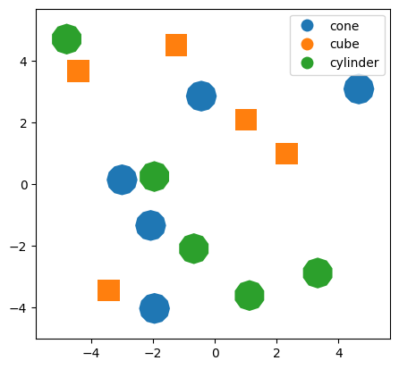
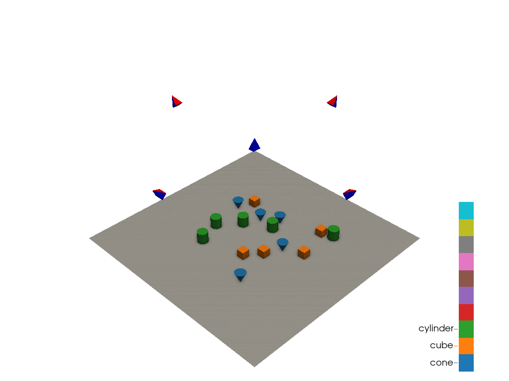
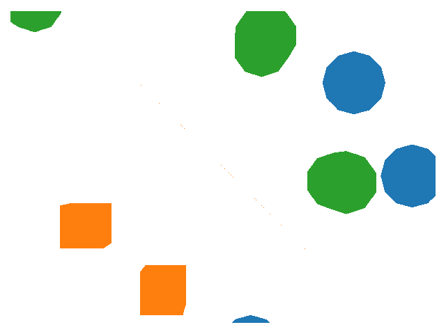
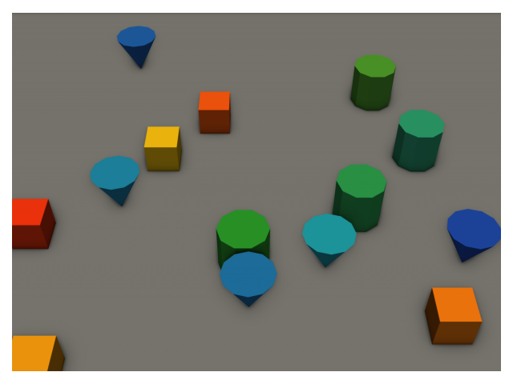
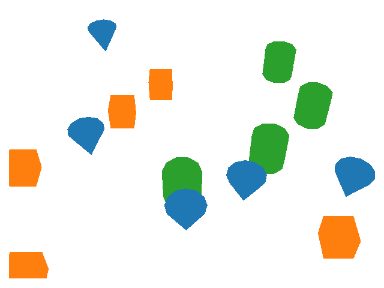
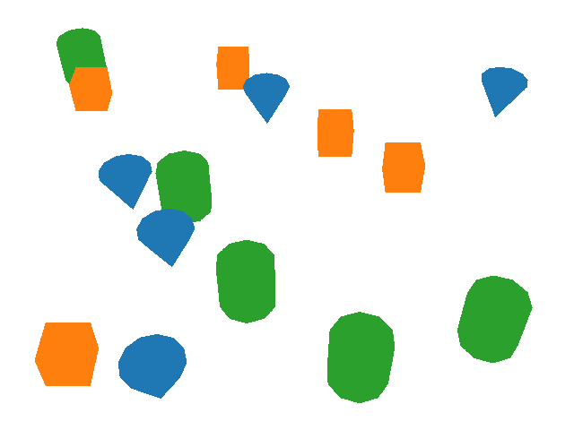

# Multi-View Mapping Toolkit (MVMT)

This tool is designed for multi-view image datasets where multiple photos are taken of the same scene. The goal is to address two related tasks: generating a prediction about one point in the real world using observations of that point from multiple viewpoints and locating where a point in the real world is observed in each image. The intended application is drone surveys for ecology but the tool is designed to be generalizable.

In drone surveys, multiple overlapping images are taken of a region. A common technique to align these images is using photogrammetry software such as the commercially-available Agisoft Metashape or open-source COLMAP. This project only supports Metashape at the moment, but we plan to expand to other software. We use two outputs from photogrammetry, the location and calibration parameters of the cameras and a 3D "mesh" model of the environment. Using techniques from graphics, we can find the correspondences between locations on the mesh and on the image. 

One task that this can support is multi-view classification. For example, if you have a computer vision model that generates land cover classifications (for example trees, shrubs, grasses, and bare earth) for each pixel in an image, these predictions can be transferred to the mesh. Then, the predictions for each viewpoint can be aggregated using a voting or averaging scheme to come up with a final land cover prediction for that location. The other task is effectively the reverse. If you have the data from the field, for example marking one geospatial region as shrubs and another as grasses, you can determine which portions of each image corresponds to these classes. This information can be used to train a computer vision model, that could be used in the first step.

# Conceptual workflow

Imagine you are trying to map the objects in a hypothetical region. Your world consists of three types of objects: cones, cubes, and cylinders. Cones are different shades of blue, cubes are difference shades of orange, and cylinders are different shades of green. Your landscape consists of a variety of these objects arranged randomly on a flat gray surface. You fly a drone survey and collect images of your scene, some of which are shown below. 

<p align="center">
  
&nbsp; &nbsp; &nbsp; &nbsp; 
  
&nbsp; &nbsp; &nbsp; &nbsp; 
  
</p>

While you are there, you also do some field work and survey a small subset of your region. Field work is labor-intensive, so you can't survey the entire region your drone flew. You note down the class of the object and their location and shape in geospatial coordinates. This results in the following geospatial map.

<p align="center">
  
</p>

You use structure from motion to build a 3D model of your scene and also estimate the locations that each image was taken from. 

<p align="center">
  
</p>

Up to this point, you have been following a fairly standard workflow. A common practice at this point would be to generate a top-down, 2D orthomosaic of the scene and do any prediction tasks, such as deep learning model training or inference, using this data. Instead, you decide it's important to maintain the high quality of the raw images and be able to see the sides of your objects when you are generating predictions. This is where MVMT comes in. 

Using your field reference map and the 3D model from photogrammetry, you determine which portions of your 3D scene correspond to each object. This is shown below, with the colors now representing the classification label.

<p align="center">
  
</p>

Your end goal is to generate predictions on the entire region. For this, you need a machine learning model that can generate automatic predictions on your data. No one else has developed a model for your cone-cube-cylinder classification task, so you need to train your own using labeled example data. Using the mesh that is textured with the classification information from the field survey, and the pose of the camera, you can "render" the labels onto the images. They are shown below, color-coded by class.

<p align="center">
  
&nbsp; &nbsp; &nbsp; &nbsp; 
  
&nbsp; &nbsp; &nbsp; &nbsp; 
  
</p>
These labels correspond to the images shown below.
<p align="center">
  
&nbsp; &nbsp; &nbsp; &nbsp; 
  
&nbsp; &nbsp; &nbsp; &nbsp; 
  
</p>

Now that you have pairs of real images and rendered labels, you can train a machine learning model to predict the class of the objects from the images. This model can be now used to generate predictions on un-labeled images. An example prediction is shown below.
<p align="center">
  
&nbsp; &nbsp; &nbsp; &nbsp; 
  
&nbsp; &nbsp; &nbsp; &nbsp; 
  
</p>

To make these predictions useful, you need the information in geospatial coordinates. We again use the mesh model as an intermediate step between the image coordinates and 2D geospatial coordinates. The predictions are projected or "splatted" onto the mesh from each viewpoint.

<p align="center">
  
&nbsp; &nbsp; &nbsp; &nbsp; 
  
</p>
<p align="center">
  
&nbsp; &nbsp; &nbsp; &nbsp; 
  
</p>

As seen above, each prediction only captures a small region of the mesh, and cannot make any predictions about parts of the object that were occluded in the original viewpoint. Therefore, we need to aggregate the predictions from all viewpoints to have an understanding of the entire scene. This gives us added robustness, because we can tolerate some prediction errors for a single viewpoint, by choosing the most common prediction across all viewpoints of a single location. The aggregated prediction is shown below.

<p align="center">
  
</p>

Now, the final step is to transform these predictions back into geospatial coordinates. 

<p align="center">
  
</p>

## Installation

There are two ways to use this tool. If you are an internal collaborator working on the `JetStream2` cloud compute environment with access to the `/ofo-share` , you can directly use an existing `conda` environment. Note that this option is only suitable if you want to use the existing functionality and not make changes to the toolkit code or dependencies. If you are an external collaborator/user or want to do development work, please create your own new environment. 

### Using existing environment

Note that you should not make any changes to this environment since these changes will impact others. Only edits to my copy of the repository will be reflected when you import the tool. To begin, you must have installed `conda` on your JetStream. Then you can tell `conda` to look in the following places for environments and packages.

```
conda config --append envs_dirs /ofo-share/repos-david/conda/envs/
conda config --append pkgs_dirs /ofo-share/repos-david/conda/pkgs/
```

Now you should see all of my conda environments when you do `conda env list` . The one you want is `MVMT-stable` , and can be activated as follows:

```
conda activate MVMT-stable
```

Use this instead of `MVMT` in future steps.

### Creating a new environment

```
conda create -n MVMT python=3.9 -y
conda activate MVMT

#If you haven't already, install [poetry](https://python-poetry.org/docs/). Now use this to install the majority of dependencies.
#For some reason, poetry may not work if it's not in a graphical session. I think some form of authentication token is managed differently.
poetry install

#Now install the `pytorch3d` dependencies that can't be installed with `poetry`.
conda install pytorch=1.13.0 torchvision pytorch-cuda=11.6 -c pytorch -c nvidia -y
conda install -c fvcore -c iopath -c conda-forge fvcore iopath -y
conda install -c bottler nvidiacub -y
conda install pytorch3d -c pytorch3d -y
```

Validate the installation

```
python -c "import torch; print(torch.cuda.is_available())"
python -c "import pytorch3d; print(pytorch3d.__version__)"
```

You may get the following error when running `pyvista` visualization:

```
libGL error: MESA-LOADER: failed to open swrast: <CONDA ENV LOCATION>/bin/../lib/libstdc++.so.6: version `GLIBCXX_3.4.30' not found (required by /lib/x86_64-linux-gnu/libLLVM-15.so.1) (search paths /usr/lib/x86_64-linux-gnu/dri:\$${ORIGIN}/dri:/usr/lib/dri, suffix _dri)
```

If this happens, you can fix it by symlinking to the system version. I don't know why this is required.

```
ln -sf /usr/lib/x86_64-linux-gnu/libstdc++.so.6 <CONDA ENV LOCATION>/lib/libstdc++.so.6
```

### Example data

The public example data is in `data/example_Emerald_Point_data` . You can run notebooks in the `examples` folder to see how to interact with this data. You can download this data using Google Drive from this [folder](https://drive.google.com/drive/folders/1gs5MkutQJEfg7tVnv01gzrf9NisAO5AT?usp=drive_link). Once you've downloaded it, extract it into the `data` folder. 

### Using your own data

If you have a Metashape scene with the location of cameras, a mesh, and geospatial information, you can likely use MVMT. If you are using the Metashape GUI, you must do an important step before exporting the mesh model. Metashape stores the mesh in an arbitrary coordinate system that's optimized for viewing and will export it as such. To fix this, in the Metashape GUI you need to do `Model->Transform Object->Reset Transform` , then save the mesh with the local coordinates option. The cameras can be exported without any special considerations.

You can also use our scripted workflow for running Metashape, [automate-metashape](https://github.com/open-forest-observatory/automate-metashape). The cameras and the `local` mesh export will be properly formatted for use with MVMT.

### Running

There are currently two main 3D workflows that this tool supports, rendering and aggregation. The goal of rendering is to take data that is associated with a mesh or geospatially referenced and translate it to the viewpoint of each image. An example of this is exporting the height above ground or species classification for each point on an image. The goal of aggregation is to take information from each viewpoint and aggregate it onto a mesh and optionally export it as a geospatial file. An example of this is taking species or veg-cover type predictions from each viewpoints and aggregating them onto the mesh.

It also provides functionality for making predictions on top-down orthomosaics. This is not the main focus of the tool but is intended as a strong baseline or for applications where only this data is available.

There is one script for each of these workflows. They each have a variety of command line options that can be used to control the behavior. But in either case, they can be run without any flags to produce an example result. To see the options, run either script with the `-h` flag as seen below.

```
conda activate MVMT
python multiview_prediction_toolkit/entrypoints/mesh_render.py --help
python multiview_prediction_toolkit/entrypoints/aggregate_viewpoints.py --help
python multiview_prediction_toolkit/entrypoints/orthomosaic_predictions.py --help
```

Quality metrics can be computed using the evaluation script

```
conda activate MVMT
python multiview_prediction_toolkit/entrypoints/evaluate_predictions.py --help
```
